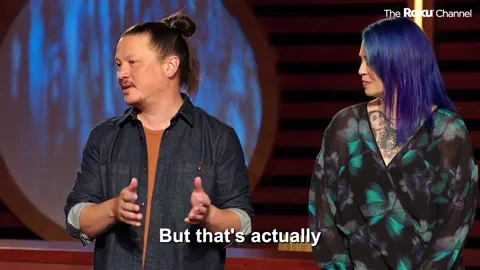

 
*Welcome to my GitHub profile!*   
*I'm a passionate front-end developer based in Bucharest. With 4+ years of experience, i focus on creating engaging and intuitive user experiences, building dynamic web applications and crafting beautiful UI's using mainly React and NextJS.*   

---
 ###  Front-End Skills:
 
:white_check_mark: Strong proficiency in HTML, CSS, and JavaScript (with Typescript).  
:white_check_mark: Experience with modern Front-End frameworks like React and NextJS. 
:white_check_mark: Responsive web design and mobile-first development. 
:white_check_mark: CSS frameworks, including Tailwind CSS and Bootstrap. 
:white_check_mark: UI/UX principles and best practices. 
:white_check_mark: Investigation and debugging skills. 
:white_check_mark: Efficient use of version control systems like Git for collaborative development. 
:white_check_mark: Performance optimization techniques to improve website speed and loading times. 
:white_check_mark: Accessibility standards and practices for creating inclusive web experiences. 

### What I bring to the table: 
 
✨ Clean and well-structured code. 
👁️ Attention to detail and pixel-perfect designs. 
🤝 Collaboration and teamwork mindset. 
🌱 Continuous learning and staying up-to-date with the latest trends.   

###  Toolset  :hammer_and_wrench: 
<a href="https://skillicons.dev">
    
    
---
    
###  Let's Connect :blush:

   &nbsp

 

*Feel free to explore my repositories to see some of my projects. Don't hesitate to reach out if you have any questions or want to collaborate on something cool. Let's create beautiful digital experiences together! 🚀*✨
